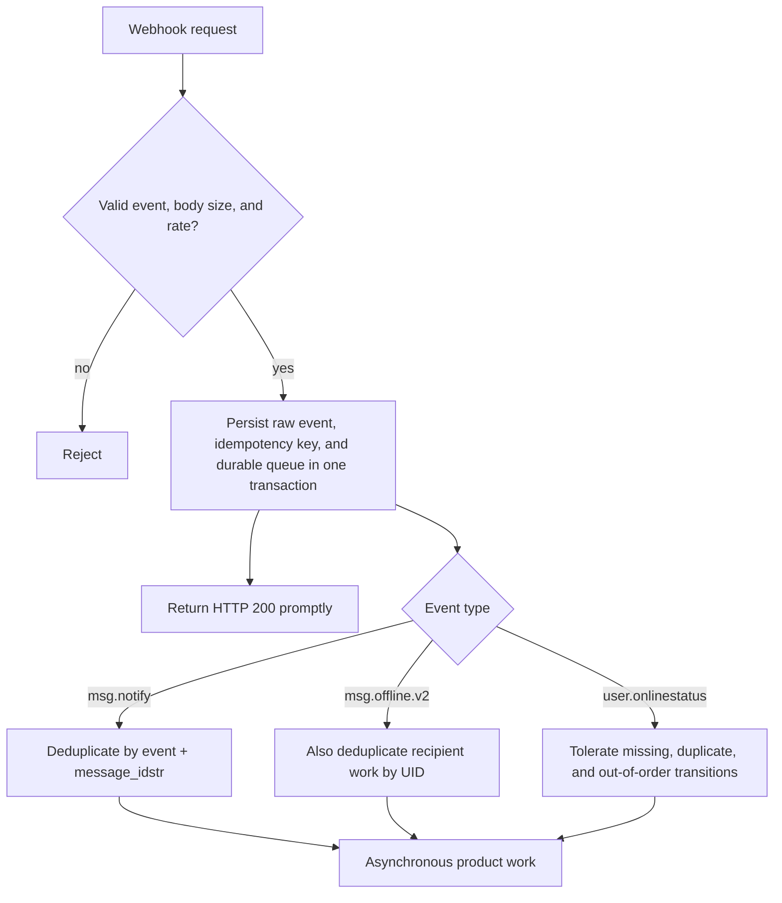

`msg.before_send` is independently enabled synchronous admission; its response allows, replaces, or rejects the send. Queue and retry semantics below apply only to the three asynchronous notifications. See [Before-send business callback](/en/guide/integration/webhooks#before-send-business-callback) for configuration, requests, and failure policies.

## Delivery semantics

Any HTTP `2xx` acknowledges asynchronous delivery. Other statuses, connection failures and timeouts fail an attempt. Responses are drained and discarded.

`msg.notify` and `msg.offline.v2` enter a bounded durable WAL outbox before HTTP dispatch. Pending records survive process restart; retries use bounded exponential backoff. Exhausted attempts become durable dead letters that operators can inspect and replay through Manager. Admission/storage exhaustion is explicitly recorded and cannot roll back the already committed message or SENDACK. `user.onlinestatus` retains the upstream bounded memory queue and best-effort lifecycle.

The default notify batch size is 1 with a 500ms maximum coalescing wait when batching is enabled; presence batches allow 512 records / 2s. Offline chunks/compression use 512 device targets. HTTP attempts default to 5s and 3 attempts before dead-letter. Each request carries `X-WK-Webhook-ID` and `X-WK-Webhook-Attempt`; consumers must deduplicate stable event IDs before acknowledging. Opt-in notify batches also carry per-item `event_id` because regrouping can change the batch ID. Delivery is at least once, with no global ordering guarantee.

## Receiver contract

Critical product state must remain reconstructable from the product database or message history.

## Security boundary

The sender adds `Content-Type: application/json` and the durable delivery identity/attempt headers. It adds **no signature, shared-secret, or Authorization header**. Do not place long-lived secrets in the webhook URL where logs may capture them.

Production controls must establish trust outside this protocol:

- use HTTPS only; prefer a private network, service mesh, or fixed egress proxy;
- enforce mTLS, fixed egress identity, or controlled credentials at a reverse proxy;
- limit source IPs, rate, and body size;
- avoid logging complete Payloads or personal data;
- never expose the callback as an anonymous public write endpoint.
