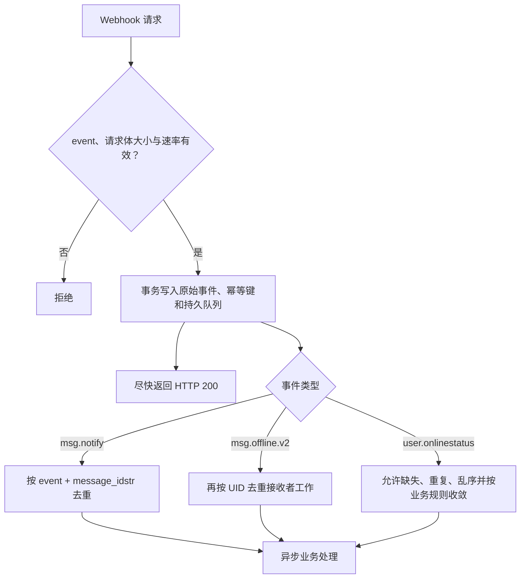

`msg.before_send` 是独立启用的同步发送前回调，响应决定放行、修改或拒绝；以下队列和重试语义仅适用于三个异步通知事件。配置、完整请求和失败策略见[发送前业务回调](/zh/guide/integration/webhooks#发送前业务回调)。

## 投递语义

异步事件以任意 HTTP `2xx` 确认成功；其他状态码、连接失败和超时均视为失败。响应体读取后丢弃。

`msg.notify` 和 `msg.offline.v2` 在 HTTP 发送前进入有界的持久 WAL outbox，待投递记录可跨进程重启恢复，失败采用有界指数退避。超过次数后保留为持久死信，可通过 Manager 查看和重放。队列或存储额度不足会明确记录，不能回滚已提交消息或成功 SENDACK。`user.onlinestatus` 保留上游内存队列和尽力投递语义。

通知默认每批 1 条；按需启用批处理后，合并等待上限默认 500ms。在线状态每批最多 512 条 / 2s；离线分块与压缩阈值为 512 个设备目标。HTTP 尝试默认 5s、3 次后进入死信。请求携带 `X-WK-Webhook-ID` 和 `X-WK-Webhook-Attempt`，接收端应先按稳定事件标识去重再确认。通知批次内还携带原始 `event_id`，因为重新分组可改变批次 ID。语义为至少一次投递，不承诺全局有序。

## 接收端合同

关键业务状态必须能从业务数据库或消息历史重建。

## 安全边界

当前 Sender 添加 `Content-Type: application/json` 及持久投递标识/次数 Header，**没有签名、共享密钥或 Authorization Header**。Webhook URL 本身也不应携带会进入日志的长期秘密。

生产环境必须在协议外建立信任：

- 仅使用 HTTPS；优先私网、服务网格或固定出口代理；
- 在反向代理层使用 mTLS、固定出口身份或受控凭据；
- 对来源 IP、速率和请求体大小设限；
- 避免记录完整 Payload 与个人数据；
- 不把回调暴露为匿名公网写入口。
